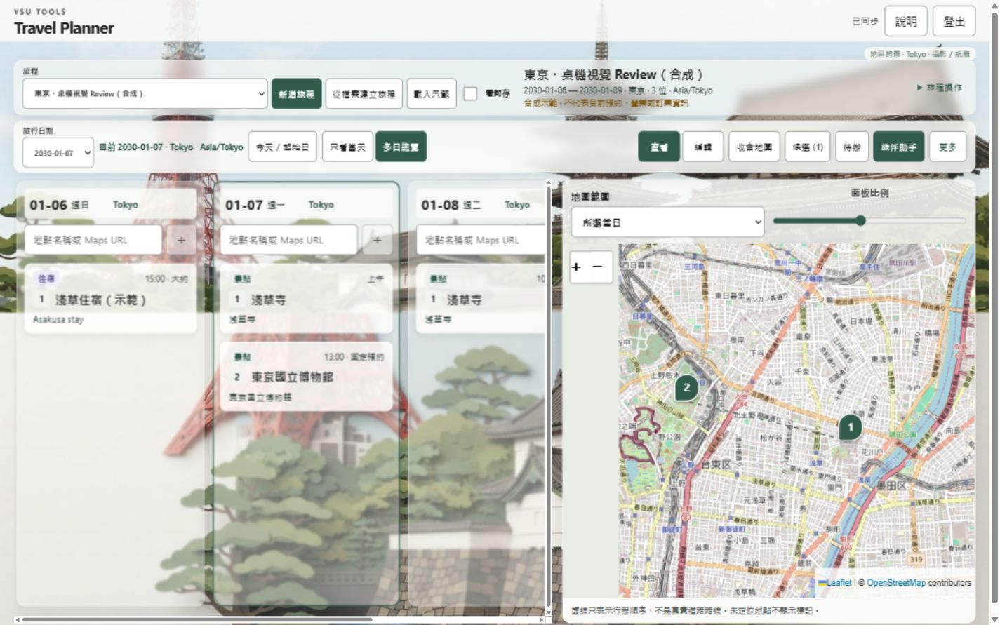
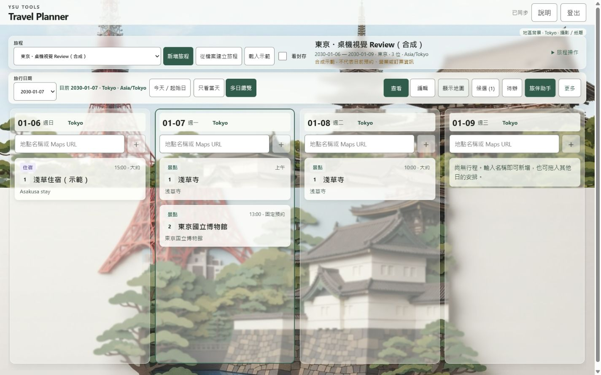

# Travel Planner production release history

## Current visual release — 2026-10-08 UTC

**Released and postrelease verified:** [Travel Planner](https://tools.ycsu.cc/travel-planner/), production `6ac71868831c850e6b4e185c`, [runtime `c1f648e770751a94eeb8d73d213cf70be33b3e1e`](https://github.com/blackeirose/YSU-Tools/commit/c1f648e770751a94eeb8d73d213cf70be33b3e1e). Product [PR #3](https://github.com/blackeirose/YSU-Tools/pull/3), authority [PR #23](https://github.com/blackeirose/social-capture-tool/pull/23). Authority canonical `e15dfb48e5c585e50bf1cc17a3a3e7471f287773`; nine executable/policy blobs matched the local publisher exactly. Product tree `49136110a5387eca89e48d9ffd0c8cea9ea29f2e` is canonical; local implementation commit `237e1999` had the identical tree. No uncommitted work was overwritten.

Fixed review URL → `6ac715f6143c29a26492bcae` → product `c1f648e770751a94eeb8d73d213cf70be33b3e1e` → authority `e15dfb48...`. Production was freshly assembled from then-current full-site baseline `6ac6d1ec1b7c7996e20be0f8`, through production-context candidate `6ac71844631591f24973ee72`, then published as `6ac71868831c850e6b4e185c`. The synthetic Preview was not promoted. No environment or shared security settings changed.

### Visual implementation and actual inspection

- Replaced the old right-hand ~45%-width / 0.24-opacity decoration with two full-width desktop background panels. They use a compact workspace composition, without a hero section.
- Day columns, cards, title/date/mode controls and related panels use surface alpha, fine borders and restrained backdrop blur. Text/buttons do not inherit opacity; map tiles/markers remain opaque. Menus/details are more solid; nested export is reachable. Opaque fallback covers missing backdrop-filter, reduced transparency and forced colors.
- Read the Owner-provided **YSU-SKILL-021 v1.0.0**, STYLE_REFERENCE and QA_CHECKLIST plus P08-012/P08-014 examples. The intended 3:4 photography / precision-paper poster was adapted by cropping two existing panels into the desktop work area. Tokyo Tower, traditional temple/pagoda and palace/castle forms are recognizable; lower paper planes, trees and short shadows are visible. This is a desktop adaptation, not an assertion that every earlier generated image meets the reference.
- The earlier production synthetic lower panel was too photographic. It was **not overwritten**. A new clearly synthetic “東京・桌機視覺 Review（合成）” trip reuses a previously generated acceptable Tokyo pair. Private Owner trips and original images remain untouched.
- Private source: old synthetic Preview `6ac63fadf5def9047a6c4eb0`. Reused top SHA256 `5b651884f333530d2aebf07dbf35f86be903c1874a8f770903db250a38850c56`; lower `0990427e6427fee49f31a71d8200995f0c0c46388816fb72d156dfdd84d1c061`. They were copied only to empty synthetic-trip keys, with create-only checks. Original image binaries, credentials and prompts are not committed.
- Production uses the existing site-scoped private Blob store. Original production images survived this ordinary deploy and read back after refresh. The new pair loaded in independent normal IAB/Chrome sessions. Preview remains deploy-scoped: its explicit synthetic asset reuse is not evidence of automatic cross-deploy persistence.
- Missing city setup and saved-image failure/reload feedback are visible near the work area. Reload is GET-only. Controlled HTTP503 image failure was tested locally; the actual production image read passed.
- 1440×900 and 1366×768 desktop, map open/closed, viewer cards, edit/detail, bright/dark background regions, and 390×844 mobile were actually viewed. DOM verified sizes; browser screenshots omit scrollbar pixels. An initially mislabeled 1366 capture was replaced after reviewer caught it. At 1366 the workspace starts at y=257.6. Mobile scrollWidth=390 with zero background image nodes. Its request-free background path was separately tested locally.

### Actual production screenshots (synthetic data)

[1366 desktop](evidence/desktop-visual-20261008/production-1366-map.jpg) · [390 mobile](evidence/desktop-visual-20261008/production-mobile-390.jpg)

### Verification and evidence boundaries

- Current source: typecheck/build PASS; 19 background unit tests and nine browser cases PASS (four viewport cases, four relevant move/selection/replacement/menu regressions and one added nested-export regression).
- Fixed Preview: normal IAB + independent Chrome login; synthetic add → cross-context read → real picker move → second-context read → Undo → refresh PASS. Two actual private panels loaded and refreshed.
- Production: runtime metadata read back `c1f648e770751a94eeb8d73d213cf70be33b3e1e`, mode production / namespace v1. Ordinary reload loaded `index-BA47nHum.css` without clearing any data. New synthetic JSON import saved; move from Jan 8 to Jan 9 read in Chrome; Undo restored Jan 8 in the other context. Fixed 13:00 museum appointment/details stayed intact. Date/card/marker selection and scoped deep refresh passed.
- Independent reviewer `/root/desktop_visual_review`: SOURCE PASS for final visual changes; separate VISUAL PASS for local actual-image component and then actual production screenshots. Reviewer did not operate the live site; author performed live operations. No measured FPS benchmark or physical device test.
- Canonical remote acceptance PASS: 326 static files, nine Functions, 307 protected non-Planner static files and six protected Function digests unchanged; UMS/capture/CA/Space/fire-pump routes/assets, traffic and cleanup schedule retained; anonymous AI/background return401; SW/manifest scope remains `/travel-planner/`. No private cache/pending/conflict clearing.
- Inherited evidence: prior source `92f6340` CI37698621712 covers unchanged server/Auth/sync/rules/budget/AI contracts. Actual prior audio, text, vision, Explore and generation retain their original source labels. The visual release did not rerun unrelated paid AI or pretend previous success was a new service call.
- Existing waiver `owner-2026-10-07-skip-remote-offline-zoom-voice` remains exactly real single-tab offline/reconnect, true200%zoom and humanmic UNVERIFIED. Physical iPhone/Safari and frame-rate measurement UNVERIFIED; no new hold or exemption introduced.

### Budget and recovery

After final readback: campaign `ux-gemini-20261005-usd1`, 28 historical requests, **US$2.79 conservative reservation / US$5.20 cumulative ceiling**, leaving US$2.41 conservative headroom. UTC2026-10-08 reservation US$0 / US$2.00 day ceiling. **This task generated zero paid AI requests. Actual provider billing remains unknown**, not zero. No usage history or unknown reserve was released.

Recovery is Planner-only: use the compatible previous product `92f63409df27f2c306141f0c51931163bc25876d` or reviewed repair; source-stamped v1 build and matching function archives; re-read the then-current full host; assemble through the canonical publisher and verify protected files/Functions/routes/schedules before production-context publication. Never restore an old full-site deploy or promote a synthetic Preview. Preserve v1 records, existing private images, site-wide budget ledger and all browser pending/conflicts. The older cb4c17f cap is incompatible with the current ledger and is not a rollback candidate.

Owner can select “東京・桌機視覺 Review（合成）” to compare map shown/hidden, viewer/edit cards and date changes, then open the same trip on a phone. No further Owner setup is required for this visual release.

---

## Historical UX / Gemini release — 2026-10-07

**Published and accepted for Owner review.** The fixed URL is [tools.ycsu.cc/travel-planner/](https://tools.ycsu.cc/travel-planner/). Netlify published production deploy `6ac6d1ec1b7c7996e20be0f8`, whose `/travel-planner/version.json` pins executable [product source `92f63409df27f2c306141f0c51931163bc25876d`](https://github.com/blackeirose/YSU-Tools/commit/92f63409df27f2c306141f0c51931163bc25876d), `mode=production`, Firebase namespace `v1`, and `/travel-planner/` base. [Source-matched CI `37698621712`](https://github.com/blackeirose/YSU-Tools/actions/runs/37698621712) passed. The [fixed isolated review URL](https://travel-planner-review--ycsu-tools-router.netlify.app/travel-planner/) retains `preview-v1` and immutable deploy `6ac6cd50977377479f81b8ba`; it is not the production source of private data.

The canonical complete-host publisher from [authority PR #23](https://github.com/blackeirose/social-capture-tool/pull/23) assembled only the Planner component against then-published baseline `6ac2c370d1409615f07878bd`. Its first production deploy `6ac6d0d00d14962c211707b5` passed complete-host probes, but live AI returned `Planner 服務設定不完整`. Netlify's five **Planner-only** Functions variables existed only in `deploy-preview`; `production` was empty. Their production contextual values were added from the existing approved site settings, except namespace set to `v1`; preview values were preserved and read back. [Netlify documents](https://docs.netlify.com/api-and-cli-guides/api-guides/get-started-with-api/) that variable changes require a new deploy. The publisher therefore built a fresh complete-host candidate from the first deploy and published final `6ac6d1ec1b7c7996e20be0f8`. No sibling or shared variable was changed. The final remote acceptance verified 326 static files, nine Functions, all six exact protected sibling Function digests, routes, traffic/schedule, deep links, scoped PWA and anonymous Planner API 401. Current UMS and other tools remained present.

Actual production browser checks used a **new synthetic Tokyo trip** in the existing Owner account, not an Owner itinerary. Google popup login succeeded in two independent contexts (Codex in-app browser and Windows Chrome). Both showed `已同步`; a new labeled synthetic item appeared in the other context after refresh. Cross-day move from 2030-01-07 to 2030-01-08 appeared there, and Undo restored the original date. The deep trip/day URL refreshed. The synthetic trip's first-day Tokyo location was explicitly selected from Photon and saved without guessing coordinates. The map displayed the 2030-01-08 Sensoji marker as day order 1; the unlocated synthetic item had no false 0,0 marker. A fixed 13:00 museum appointment on 2030-01-07 stayed fixed.

Production AI and private storage were exercised, not inferred from source review. The first text request asked to change a repeated-name Sensoji and correctly requested disambiguation without modifying data. After selecting the 2030-01-08 Sensoji card, a second real request changed its approximate time 10:00→11:00; Chrome refreshed and read 11:00, then Undo restored 10:00. Production background generation completed landmarks, photo and relief; two 1264×848 private Blob images rendered after refresh in the second authenticated context. No image regeneration was needed on refresh. Source-matched pre-release synthetic WAV service validation passed recognition, explicit confirmation, saved action, two-context readback and Undo. Previous real vision import and sourced Explore tests apply only to unchanged paths, as detailed in the [Full Gate](UPGRADE_GATE_2026-10-03.md); they were not re-billed solely to change deployment.

The single durable campaign `ux-gemini-20261005-usd1` was read after post-release smoke: **28 reservations / US$2.79 conservative upper bound** of the Owner-approved **US$5.20** cumulative ceiling, leaving **US$2.41**. UTC 2026-10-07 reserved **US$1.59** of the **US$2.00** daily ceiling. The 1→2→2.6→5.2 grant history, unknown failed-request costs and all older reservations remain. Actual provider billing is **UNKNOWN**; reserved upper bounds are not a bill. No new campaign or paid service was created.

The Full Gate decision is `PASS_WITH_OWNER_WAIVER`, exact decision `owner-2026-10-07-skip-remote-offline-zoom-voice`. Real single-tab Offline/Online and conflict recovery, actual Chrome 200% zoom, and **human microphone** are **UNVERIFIED by Owner choice**; synthetic WAV through the real AI service and itinerary action is separately PASS. Physical iPhone/Safari are also UNVERIFIED. Emulator tests and prior viewport checks are not substitutes for those real-device cases. No Supabase, DNS, MAIN or Tracker change was made.

Recovery: keep the current complete-host baseline and private `v1` records, browser IndexedDB pending/conflicts, and the shared AI budget Blob. If a Planner regression appears, assemble a **Planner-only** compatible prior executable through the canonical publisher against the *then-current* whole-site baseline; verify schema and budget compatibility first. Never restore `6ac2c370...` as a whole site or promote a synthetic Preview, because that could erase newer UMS or sibling Functions. The previous Planner runtime `cb4c17f` has an older US$2.60 source cap, so paid AI would fail closed against the current US$2.79 ledger; use a reviewed compatible repair or Planner-only disablement while retaining the ledger.
