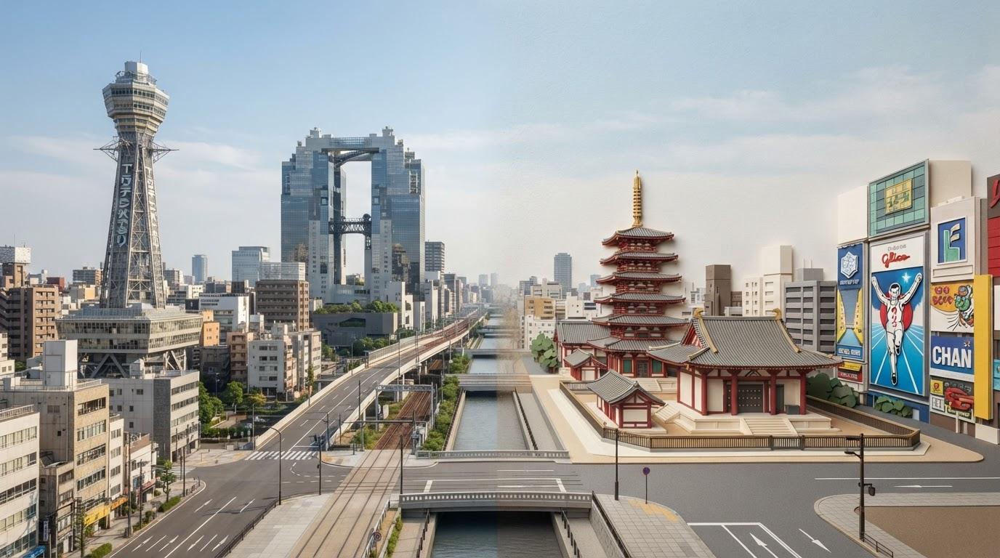
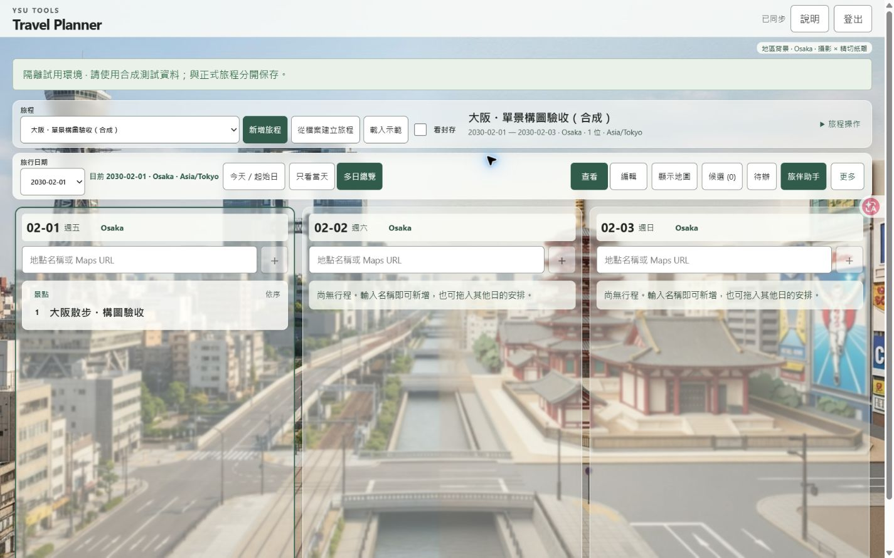
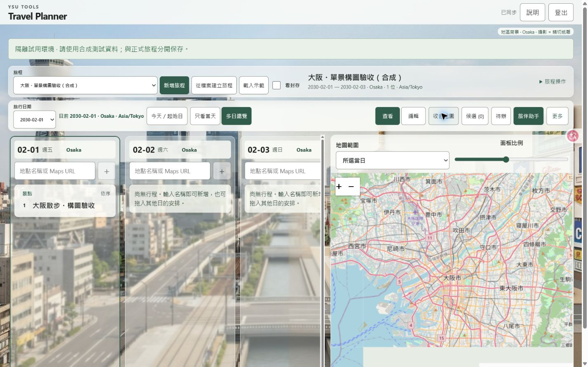
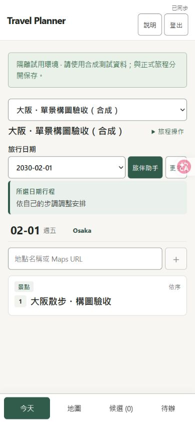
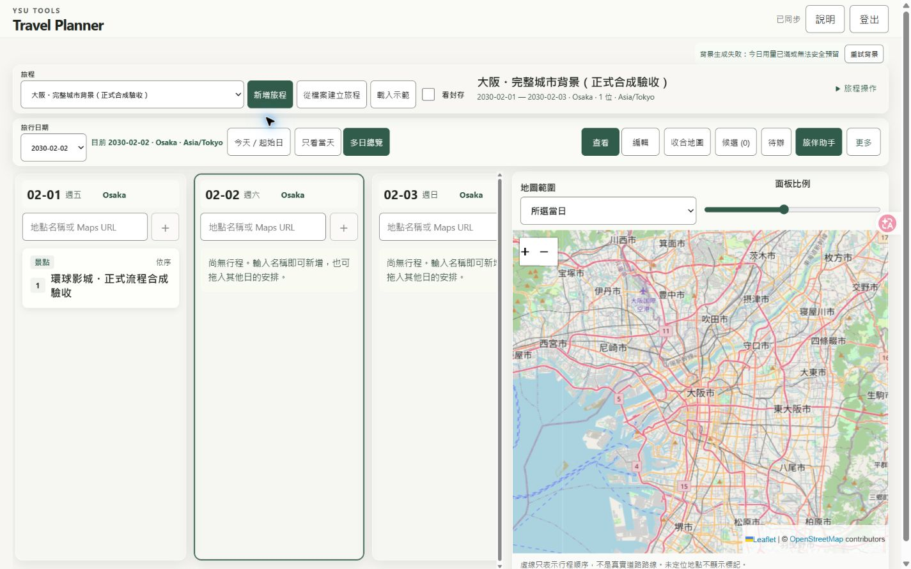

## Current background repair — 2026-10-08 UTC

**Production updated; final production new-image acceptance BLOCKED by the existing daily count limit, not fully complete / not a new LKG.** [YCSU](https://tools.ycsu.cc/travel-planner/) serves deploy `6ac7354897cc2d6be6c79507`, runtime [`32857b8b73d77b1d7d43bd0af4e797e1cb9438a2`](https://github.com/blackeirose/YSU-Tools/commit/32857b8b73d77b1d7d43bd0af4e797e1cb9438a2), namespace `v1`. Fixed [review](https://travel-planner-review--ycsu-tools-router.netlify.app/travel-planner/) maps to immutable `6ac732b3149e1c79f96a7079`, same runtime, isolated `preview-v1`. Documentation commits do not change runtime.

The two stacked/cropped panoramas are replaced by one coherent landscape poster; distinct landmark subsets occupy photography and precision-paper regions. New-trip city search now confirms real Photon identity/country/coordinates/IANA zone in the creation form. Plain-text/offline creation remains available with nearby confirmation, no guessed coordinates. Old private images are retained and labelled legacy; no bulk or automatic paid replacement. New `poster-v2` objects use private, namespace/owner/trip-separated site storage and survive ordinary deployments.

Final Preview: UI-created Osaka (no seeded coordinates/image) selected the real city and automatically generated in **14.4 seconds**; private image, refresh and independent Chrome/IAB readback PASS. Independent `/root/background_final_review` viewed the actual original and 1920/1440/1366 desktop map-open/closed plus390 mobile: VISUAL PASS. Earlier `8cf6851` production image repeated landmarks and FAILED visual review; it is retained as historical evidence, not relabelled as final success.

Production: version, complete-host isolation, Owner login, synthetic add/move/Undo/refresh/two-context readback PASS. Final fresh Osaka image attempt returned429 before Gemini, paid attempts0. Firebase Console readback of `v1` UTC2026-10-08 usage: backgroundCount2, reservedMicrousd440000, other mode counts0. The existing per-user two-background/day rule is separate from the campaign budget. **Do not retry before2026-10-09 00:00 UTC /2026-10-08 17:00 America/Los_Angeles**, clear counters, raise limits or change namespace. At that time resume the same synthetic trip's Retry background, inspect actual final image/UI and read it in the other context; no new approval or deployment is needed. [Exact evidence and recovery](https://github.com/blackeirose/YSU-Tools/blob/feature/travel-planner-ux-gemini-20261003/travel-planner/docs/PRODUCTION_RELEASE_2026-10-07.md).

[CI37733596201](https://github.com/blackeirose/YSU-Tools/actions/runs/37733596201) at8cf:155unit/9rules/9emulator-browser PASS. Final328 changes only image prompt and its contract assertion:19affected tests/typecheck/build PASS locally. Unchanged Auth/sync/rules CI is inherited with that boundary; no separate CI run on328 is claimed. Four local city UI cases cover choice, retry, ambiguous results and text-only save. Exact Owner offline/200%-zoom/human-mic waivers remain UNVERIFIED; physical iPhone/Safari and measured FPS are UNVERIFIED.

Budget readback: **35 requests /US$3.57 conservative reserved; US$1.63 campaign remaining**, UTC2026-10-08 reservedUS$0.78. Same campaign `ux-gemini-20261005-usd1`, capsUS$5.20 total/US$2 UTC-day unchanged. This repair made6paid calls/US$0.72 reserved; final production quota rejection made0paid calls. Actual provider billing UNKNOWN; no old costs released. ReserveUS$0.24 for the pending production generation.

Core main `57a69136b7473718dfcf26311ae801f033696f05` read remotely. Canonical authority `4912b011ad6dbb17d3e004557a1eadc936cf8e0f`, executable/policy blobs equal local. Git auto-deploy disabled; complete-host assembly preserved307sibling files/6sibling Functions, routes/headers/schedules/traffic. No shared rules/provider/DNS/services/Supabase/MAIN/Tracker changes. Prefer a Planner-only forward fix; preserve v2 reader/fields, old images, ledger and pending/conflicts when reverting UI. Never roll back an old whole site.

---

### Evidence and release sequence

| Scope | Result / exact evidence |
|---|---|
| Preview8cf new Osaka | UI36ead074… save05:46:07.485Z → ready05:46:18.883Z; real generated single image; add during running, fixed09:00, move/Undo and other-context readback PASS |
| Intermediate production8cf | Deploy6ac730811cb922698cd93d92; fresh Osaka bf5c616d… save05:59:55.551Z →ready06:00:06.787Z. Generation/storage PASS, actual image VISUAL FAIL: same landmarks repeated left/right. No fee released. |
| Final Preview328 | UI9d5ac2ea-d596-4f96-b64b-ba72da8b3127; save06:07:14.169Z →job06:07:17.450Z →ready06:07:28.573Z. One attempt;1376×768; landscape-3; no seeded data. Independent original/UI visual PASS. Refresh and other context retain image; ledger35/$3.57 stable. |
| Final production328 | Reassembled from current6ac730811cb922698cd93d92 → candidate6ac73500e9bbb1eb2cbea9c4 →production6ac7354897cc2d6be6c79507. No Preview promotion. Complete-host live validation PASS. |
| Production retry target | UI435e310b-b4b0-49dd-acf2-10211b10729f; save06:18:36.418Z →429job06:18:39.677Z, attempts0. No provider call. CityJapan/AsiaTokyo saved, itinerary remains editable, movedFeb1→2/Undo/refresh and IAB readback PASS. |
| Legacy | Old synthetic Tokyo source images remain readable with explicit legacy label and no regeneration. Prior v2 private images remain site-scoped. This does not repair their historical image quality. |

The original style package YSU-SKILL-021 v1.0.0, STYLE_REFERENCE, QA_CHECKLIST and P08-012 reference were read. This is an explicit landscape adaptation (photo-left, precision-paper-right) of its material relationship, not a claim of exact original portrait upper/lower geometry. Final prompt assigns each independently sourced landmark to exactly one side and asks for a continuous horizon/ground. It does not splice old image files or hide a seam with opacity. A generated city collage is illustrative, not a geographically accurate street view.

Root causes: old renderer used two independently cropped images in50%/50% rows; new renderer has one responsive image. Original new-trip form saved only text while background required name/timezone/lat/lng; integrated city selection now saves real identity and timezone and marks new v2 generation intent. Confirmed source identity can satisfy generation without unnecessarily requiring precise coordinates; map coordinates still must be real. Failed/ambiguous city search preserves the draft. In-flight trip/city changes are guarded. CAS job ownership locks precede paid calls; unknown timeouts stay reserved, known400 is not blindly retried, saved-poster crash recovery avoids a second provider call.

Production artifact manifest SHA256 `7d2d2a43347b20b854101c7da063852e7bfbabe692741ad9ea571ab3d9aebaaf`; Preview manifest `b9f0807662e2b46aa6e5903b46a7cde795e4aa1a8b0c7c00c6523e730178b65f`. Lockfile SHA256 `3c450d86ec61cc13cdd640fb2b802d068f86b927f8c6886756f4545f93cf14a9`. Function SHA256: background `e16c1527d1236439d68026b5b80bba384dec1160b7bbed8a978d8c36c618fd9d`; read `943156ffdfd5fa42699dab9782e5c5a51f45a9aa9ab0413541fc08445d547f7b`;AI `df1ccca436dded8e67747cd544ec365b7f0a1085aa5be8fc99f7e939be1efce5`.

Independent reviewer: `/root/background_final_review` separately reviewed source risks and actual images/UI. Final source PASS; final Preview actual image and requested sizes PASS. Reviewer rejected the intermediate production image and confirmed the later quota stop boundary. Console/live429 evidence is primary-agent observation, not falsely attributed to reviewer. Screenshot raster dimensions may exclude browser scrollbars; DOM viewport was explicitly set1920×1080,1440×900,1366×768,390×844. Pink A overlay belongs to `codex-agent-overlay-root`, not product UI. No physical-phone claim.

### Actual images (synthetic only)

Final Preview original, **not a production-generation claim**:

Actual final production quota state, **not hidden or replaced with Preview evidence**:

### Resume and compatible recovery

After2026-10-09 00:00 UTC, reread current runtime/baseline, campaign and v1 daily usage. Open [the existing production synthetic trip](https://tools.ycsu.cc/travel-planner/trips/435e310b-b4b0-49dd-acf2-10211b10729f/day/2030-02-01), click Retry background once, then inspect actual landscape-3 original/UI, refresh and independent context. Upper boundUS$0.24 remains withinUS$1.63 campaign remainder. The rejected job has paid attempts0; never erase it, private pending/conflicts, old counters or unknown charges. No extra budget or generic release permission is required.

Do not call this a new LKG until that postrelease visual check passes. No automatic rollback is warranted for an enforced quota: core data and isolation pass. If a real regression requires repair, use final328 as a compatible forward-fix base; retain v2 job/image read and optional Trip/DayCity fields, preserve ledger grants/entries and legacy images. Reassemble against the then-current entire site via social-capture-tool; replace Planner only. Do not promote an old draft or restore a historical whole site. In-app browser tab96 with an unsaved synthetic Place form was left untouched after auto-review rejected a reload; no retry through another method was used.

---

## Historical releases (superseded; earlier visual acceptance was rejected)

# Travel Planner production release history

## Current visual release — 2026-10-08 UTC

**Released and postrelease verified:** [Travel Planner](https://tools.ycsu.cc/travel-planner/), production `6ac71868831c850e6b4e185c`, [runtime `c1f648e770751a94eeb8d73d213cf70be33b3e1e`](https://github.com/blackeirose/YSU-Tools/commit/c1f648e770751a94eeb8d73d213cf70be33b3e1e). Product [PR #3](https://github.com/blackeirose/YSU-Tools/pull/3), authority [PR #23](https://github.com/blackeirose/social-capture-tool/pull/23). Authority canonical `e15dfb48e5c585e50bf1cc17a3a3e7471f287773`; nine executable/policy blobs matched the local publisher exactly. Product tree `49136110a5387eca89e48d9ffd0c8cea9ea29f2e` is canonical; local implementation commit `237e1999` had the identical tree. No uncommitted work was overwritten.

Fixed review URL → `6ac715f6143c29a26492bcae` → product `c1f648e770751a94eeb8d73d213cf70be33b3e1e` → authority `e15dfb48...`. Production was freshly assembled from then-current full-site baseline `6ac6d1ec1b7c7996e20be0f8`, through production-context candidate `6ac71844631591f24973ee72`, then published as `6ac71868831c850e6b4e185c`. The synthetic Preview was not promoted. No environment or shared security settings changed.

### Visual implementation and actual inspection

- Replaced the old right-hand ~45%-width / 0.24-opacity decoration with two full-width desktop background panels. They use a compact workspace composition, without a hero section.
- Day columns, cards, title/date/mode controls and related panels use surface alpha, fine borders and restrained backdrop blur. Text/buttons do not inherit opacity; map tiles/markers remain opaque. Menus/details are more solid; nested export is reachable. Opaque fallback covers missing backdrop-filter, reduced transparency and forced colors.
- Read the Owner-provided **YSU-SKILL-021 v1.0.0**, STYLE_REFERENCE and QA_CHECKLIST plus P08-012/P08-014 examples. The intended 3:4 photography / precision-paper poster was adapted by cropping two existing panels into the desktop work area. Tokyo Tower, traditional temple/pagoda and palace/castle forms are recognizable; lower paper planes, trees and short shadows are visible. This is a desktop adaptation, not an assertion that every earlier generated image meets the reference.
- The earlier production synthetic lower panel was too photographic. It was **not overwritten**. A new clearly synthetic “東京・桌機視覺 Review（合成）” trip reuses a previously generated acceptable Tokyo pair. Private Owner trips and original images remain untouched.
- Private source: old synthetic Preview `6ac63fadf5def9047a6c4eb0`. Reused top SHA256 `5b651884f333530d2aebf07dbf35f86be903c1874a8f770903db250a38850c56`; lower `0990427e6427fee49f31a71d8200995f0c0c46388816fb72d156dfdd84d1c061`. They were copied only to empty synthetic-trip keys, with create-only checks. Original image binaries, credentials and prompts are not committed.
- Production uses the existing site-scoped private Blob store. Original production images survived this ordinary deploy and read back after refresh. The new pair loaded in independent normal IAB/Chrome sessions. Preview remains deploy-scoped: its explicit synthetic asset reuse is not evidence of automatic cross-deploy persistence.
- Missing city setup and saved-image failure/reload feedback are visible near the work area. Reload is GET-only. Controlled HTTP503 image failure was tested locally; the actual production image read passed.
- 1440×900 and 1366×768 desktop, map open/closed, viewer cards, edit/detail, bright/dark background regions, and 390×844 mobile were actually viewed. DOM verified sizes; browser screenshots omit scrollbar pixels. An initially mislabeled 1366 capture was replaced after reviewer caught it. At 1366 the workspace starts at y=257.6. Mobile scrollWidth=390 with zero background image nodes. Its request-free background path was separately tested locally.

### Actual production screenshots (synthetic data)

[1366 desktop](evidence/desktop-visual-20261008/production-1366-map.jpg) · [390 mobile](evidence/desktop-visual-20261008/production-mobile-390.jpg)

### Verification and evidence boundaries

- Current source: typecheck/build PASS; 19 background unit tests and nine browser cases PASS (four viewport cases, four relevant move/selection/replacement/menu regressions and one added nested-export regression).
- Fixed Preview: normal IAB + independent Chrome login; synthetic add → cross-context read → real picker move → second-context read → Undo → refresh PASS. Two actual private panels loaded and refreshed.
- Production: runtime metadata read back `c1f648e770751a94eeb8d73d213cf70be33b3e1e`, mode production / namespace v1. Ordinary reload loaded `index-BA47nHum.css` without clearing any data. New synthetic JSON import saved; move from Jan 8 to Jan 9 read in Chrome; Undo restored Jan 8 in the other context. Fixed 13:00 museum appointment/details stayed intact. Date/card/marker selection and scoped deep refresh passed.
- Independent reviewer `/root/desktop_visual_review`: SOURCE PASS for final visual changes; separate VISUAL PASS for local actual-image component and then actual production screenshots. Reviewer did not operate the live site; author performed live operations. No measured FPS benchmark or physical device test.
- Canonical remote acceptance PASS: 326 static files, nine Functions, 307 protected non-Planner static files and six protected Function digests unchanged; UMS/capture/CA/Space/fire-pump routes/assets, traffic and cleanup schedule retained; anonymous AI/background return401; SW/manifest scope remains `/travel-planner/`. No private cache/pending/conflict clearing.
- Inherited evidence: prior source `92f6340` CI37698621712 covers unchanged server/Auth/sync/rules/budget/AI contracts. Actual prior audio, text, vision, Explore and generation retain their original source labels. The visual release did not rerun unrelated paid AI or pretend previous success was a new service call.
- Existing waiver `owner-2026-10-07-skip-remote-offline-zoom-voice` remains exactly real single-tab offline/reconnect, true200%zoom and humanmic UNVERIFIED. Physical iPhone/Safari and frame-rate measurement UNVERIFIED; no new hold or exemption introduced.

### Budget and recovery

After final readback: campaign `ux-gemini-20261005-usd1`, 28 historical requests, **US$2.79 conservative reservation / US$5.20 cumulative ceiling**, leaving US$2.41 conservative headroom. UTC2026-10-08 reservation US$0 / US$2.00 day ceiling. **This task generated zero paid AI requests. Actual provider billing remains unknown**, not zero. No usage history or unknown reserve was released.

Recovery is Planner-only: use the compatible previous product `92f63409df27f2c306141f0c51931163bc25876d` or reviewed repair; source-stamped v1 build and matching function archives; re-read the then-current full host; assemble through the canonical publisher and verify protected files/Functions/routes/schedules before production-context publication. Never restore an old full-site deploy or promote a synthetic Preview. Preserve v1 records, existing private images, site-wide budget ledger and all browser pending/conflicts. The older cb4c17f cap is incompatible with the current ledger and is not a rollback candidate.

Owner can select “東京・桌機視覺 Review（合成）” to compare map shown/hidden, viewer/edit cards and date changes, then open the same trip on a phone. No further Owner setup is required for this visual release.

---

## Historical UX / Gemini release — 2026-10-07

**Published and accepted for Owner review.** The fixed URL is [tools.ycsu.cc/travel-planner/](https://tools.ycsu.cc/travel-planner/). Netlify published production deploy `6ac6d1ec1b7c7996e20be0f8`, whose `/travel-planner/version.json` pins executable [product source `92f63409df27f2c306141f0c51931163bc25876d`](https://github.com/blackeirose/YSU-Tools/commit/92f63409df27f2c306141f0c51931163bc25876d), `mode=production`, Firebase namespace `v1`, and `/travel-planner/` base. [Source-matched CI `37698621712`](https://github.com/blackeirose/YSU-Tools/actions/runs/37698621712) passed. The [fixed isolated review URL](https://travel-planner-review--ycsu-tools-router.netlify.app/travel-planner/) retains `preview-v1` and immutable deploy `6ac6cd50977377479f81b8ba`; it is not the production source of private data.

The canonical complete-host publisher from [authority PR #23](https://github.com/blackeirose/social-capture-tool/pull/23) assembled only the Planner component against then-published baseline `6ac2c370d1409615f07878bd`. Its first production deploy `6ac6d0d00d14962c211707b5` passed complete-host probes, but live AI returned `Planner 服務設定不完整`. Netlify's five **Planner-only** Functions variables existed only in `deploy-preview`; `production` was empty. Their production contextual values were added from the existing approved site settings, except namespace set to `v1`; preview values were preserved and read back. [Netlify documents](https://docs.netlify.com/api-and-cli-guides/api-guides/get-started-with-api/) that variable changes require a new deploy. The publisher therefore built a fresh complete-host candidate from the first deploy and published final `6ac6d1ec1b7c7996e20be0f8`. No sibling or shared variable was changed. The final remote acceptance verified 326 static files, nine Functions, all six exact protected sibling Function digests, routes, traffic/schedule, deep links, scoped PWA and anonymous Planner API 401. Current UMS and other tools remained present.

Actual production browser checks used a **new synthetic Tokyo trip** in the existing Owner account, not an Owner itinerary. Google popup login succeeded in two independent contexts (Codex in-app browser and Windows Chrome). Both showed `已同步`; a new labeled synthetic item appeared in the other context after refresh. Cross-day move from 2030-01-07 to 2030-01-08 appeared there, and Undo restored the original date. The deep trip/day URL refreshed. The synthetic trip's first-day Tokyo location was explicitly selected from Photon and saved without guessing coordinates. The map displayed the 2030-01-08 Sensoji marker as day order 1; the unlocated synthetic item had no false 0,0 marker. A fixed 13:00 museum appointment on 2030-01-07 stayed fixed.

Production AI and private storage were exercised, not inferred from source review. The first text request asked to change a repeated-name Sensoji and correctly requested disambiguation without modifying data. After selecting the 2030-01-08 Sensoji card, a second real request changed its approximate time 10:00→11:00; Chrome refreshed and read 11:00, then Undo restored 10:00. Production background generation completed landmarks, photo and relief; two 1264×848 private Blob images rendered after refresh in the second authenticated context. No image regeneration was needed on refresh. Source-matched pre-release synthetic WAV service validation passed recognition, explicit confirmation, saved action, two-context readback and Undo. Previous real vision import and sourced Explore tests apply only to unchanged paths, as detailed in the [Full Gate](UPGRADE_GATE_2026-10-03.md); they were not re-billed solely to change deployment.

The single durable campaign `ux-gemini-20261005-usd1` was read after post-release smoke: **28 reservations / US$2.79 conservative upper bound** of the Owner-approved **US$5.20** cumulative ceiling, leaving **US$2.41**. UTC 2026-10-07 reserved **US$1.59** of the **US$2.00** daily ceiling. The 1→2→2.6→5.2 grant history, unknown failed-request costs and all older reservations remain. Actual provider billing is **UNKNOWN**; reserved upper bounds are not a bill. No new campaign or paid service was created.

The Full Gate decision is `PASS_WITH_OWNER_WAIVER`, exact decision `owner-2026-10-07-skip-remote-offline-zoom-voice`. Real single-tab Offline/Online and conflict recovery, actual Chrome 200% zoom, and **human microphone** are **UNVERIFIED by Owner choice**; synthetic WAV through the real AI service and itinerary action is separately PASS. Physical iPhone/Safari are also UNVERIFIED. Emulator tests and prior viewport checks are not substitutes for those real-device cases. No Supabase, DNS, MAIN or Tracker change was made.

Recovery: keep the current complete-host baseline and private `v1` records, browser IndexedDB pending/conflicts, and the shared AI budget Blob. If a Planner regression appears, assemble a **Planner-only** compatible prior executable through the canonical publisher against the *then-current* whole-site baseline; verify schema and budget compatibility first. Never restore `6ac2c370...` as a whole site or promote a synthetic Preview, because that could erase newer UMS or sibling Functions. The previous Planner runtime `cb4c17f` has an older US$2.60 source cap, so paid AI would fail closed against the current US$2.79 ledger; use a reviewed compatible repair or Planner-only disablement while retaining the ledger.
